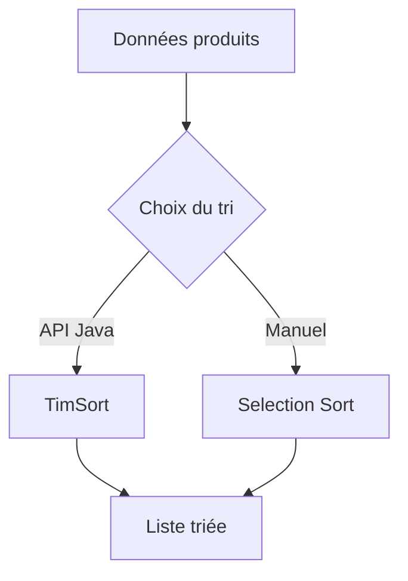

# Comparaison des algorithmes de tri dans `SortProductsUseCase`

##  Auteur
**Lucas PEREZ**  
Projet POO en JAVA — ESGI2 Campus Éductive  
Trimestre 2 – 2025/2026  

---

## 1. Contexte du cas d’usage

Dans le cas d’usage `SortProductsUseCase`, deux approches distinctes sont proposées pour trier des produits par prix croissant :

- **Tri via l’API Java standard** (`List.sort` + `Comparator.comparingDouble`)
- **Tri manuel par sélection** (Selection Sort), implémenté explicitement

L’objectif n’est pas uniquement fonctionnel, mais aussi **pédagogique et architectural** :
- comparer une solution industrielle optimisée,
- à une implémentation algorithmique simple et maîtrisée.

---

## 2. Tri via l’API Java (`Comparator + sort`)

### 2.1 Principe général

La méthode :
```java
products.sort(Comparator.comparingDouble(Product::getPrice));
```
délègue entièrement le tri à la bibliothèque standard Java.

### 2.2 Algorithme sous-jacent

Pour les objets (`List<Product>`), Java utilise **TimSort** :
- algorithme hybride dérivé de **Merge Sort** et **Insertion Sort**,
- stable,
- adaptatif (très performant sur des données partiellement triées).

### 2.3 Complexité

| Cas | Complexité temporelle |
|----|----------------------|
| Meilleur | O(n) |
| Moyen | O(n log n) |
| Pire | O(n log n) |

Complexité spatiale : **O(n)** (tableaux temporaires).

### 2.4 Avantages

- Performances élevées
- Code très lisible
- Fiabilité éprouvée
- Gestion correcte des égalités (stabilité)

### 2.5 Inconvénients

- Boîte noire algorithmique
- Moins pédagogique
- Dépendance forte à la bibliothèque

---

## 3. Tri par sélection (Selection Sort)

### 3.1 Principe général

Le tri par sélection :
1. cherche le minimum du tableau,
2. l’échange avec la première position,
3. recommence sur le sous-tableau restant.

### 3.2 Exemple pas à pas

Liste des prix :
```
[12.5, 3.0, 9.9, 5.2]
```

Étapes :
1. minimum = 3.0 → échange avec 12.5
2. minimum = 5.2 → échange avec 12.5
3. minimum = 9.9 → déjà en place

Résultat :
```
[3.0, 5.2, 9.9, 12.5]
```

### 3.3 Complexité

| Cas | Complexité |
|----|-----------|
| Meilleur | O(n²) |
| Moyen | O(n²) |
| Pire | O(n²) |

Complexité spatiale : **O(1)** (en place).

### 3.4 Avantages

- Implémentation simple
- Prévisible
- Bon support pédagogique
- Utile pour benchmarking

### 3.5 Inconvénients

- Très lent sur grands volumes
- Non stable (dans cette implémentation)
- Inadapté à la production

---

## 4. Comparaison synthétique

| Critère | API Java (TimSort) | Selection Sort |
|-------|-------------------|----------------|
| Complexité | O(n log n) | O(n²) |
| Stabilité | Oui | Non |
| Lisibilité | Très élevée | Moyenne |
| Performance | Excellente | Faible |
| Usage réel | Production | Pédagogie |
| Maintenance | Faible | Élevée |

---

## 5. Schéma conceptuel



---

## 6. Conclusion architecturale

Le double choix proposé dans `SortProductsUseCase` est **pertinent et professionnel** :

- **`sortByPrice()`** : solution industrielle, à utiliser en production.
- **`sortByPriceSelectionSort()`** : outil pédagogique et de comparaison.

Cette approche démontre :
- une compréhension des algorithmes,
- une capacité à justifier les choix techniques,
- une vraie démarche d’ingénierie logicielle.

Dans une architecture propre, cette dualité est un **atout**, pas une faiblesse.
