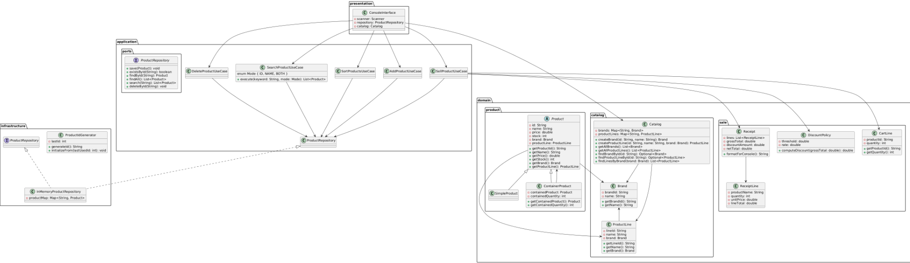
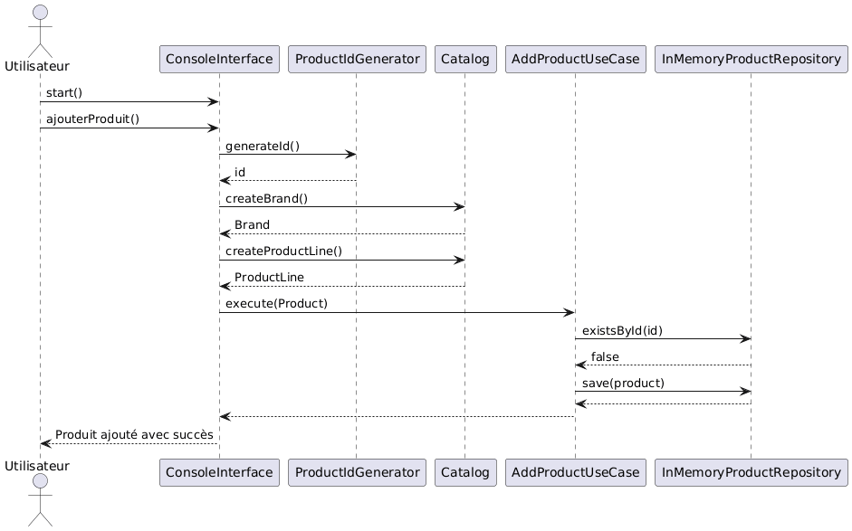
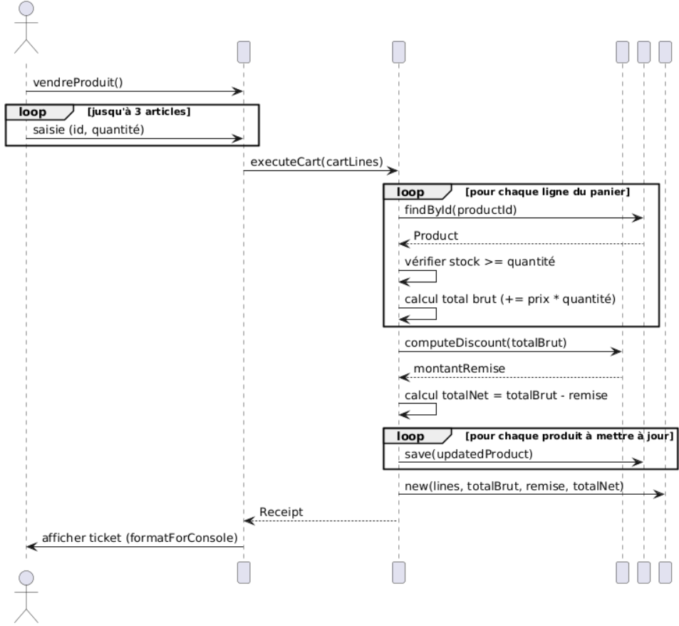
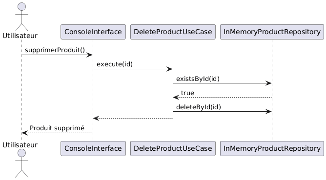
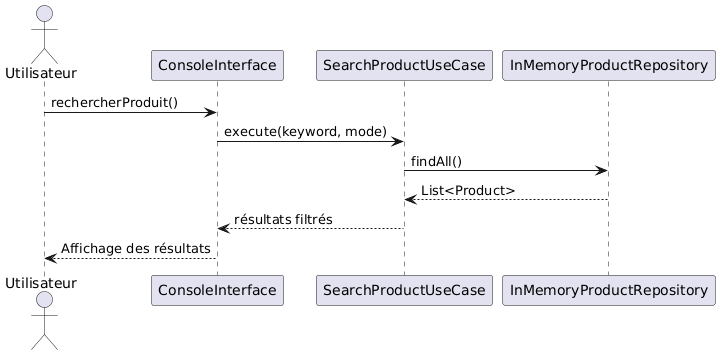

# Documentation UML du Projet de Gestion de Stock

##  Auteur
**Lucas PEREZ**  
Projet POO en JAVA — ESGI2 Campus Éductive  
Trimestre 2 – 2025/2026

---

Ce document fournit une vue d'ensemble de la modélisation UML du projet, incluant un **diagramme de classes** et des **diagrammes de séquence** représentatifs.

---

## 1. Diagramme de Classes

Ce diagramme décrit les principales entités métier du système, leur structure, et leurs relations.



```java
@startuml
package "domain.catalog" {
  class Brand {
    - brandId: String
    - name: String
    + getBrandId(): String
    + getName(): String
  }

  class ProductLine {
    - lineId: String
    - name: String
    - brand: Brand
    + getLineId(): String
    + getName(): String
    + getBrand(): Brand
  }

  class Catalog {
    - brands: Map<String, Brand>
    - productLines: Map<String, ProductLine>
    + createBrand(id: String, name: String): Brand
    + createProductLine(id: String, name: String, brand: Brand): ProductLine
    + getAllBrands(): List<Brand>
    + getAllProductLines(): List<ProductLine>
    + findBrandById(id: String): Optional<Brand>
    + findProductLineById(id: String): Optional<ProductLine>
    + findLinesByBrand(brand: Brand): List<ProductLine>
  }

  Brand <-- ProductLine
  Catalog --> Brand
  Catalog --> ProductLine
}

package "domain.product" {
  abstract class Product {
    - id: String
    - name: String
    - price: double
    - stock: int
    - brand: Brand
    - productLine: ProductLine
    + getProductId(): String
    + getName(): String
    + getPrice(): double
    + getStock(): int
    + getBrand(): Brand
    + getProductLine(): ProductLine
  }

  class SimpleProduct
  class ContainerProduct {
    - containedProduct: Product
    - containedQuantity: int
    + getContainedProduct(): Product
    + getContainedQuantity(): int
  }

  Product <|-- SimpleProduct
  Product <|-- ContainerProduct
  Product --> Brand
  Product --> ProductLine
  ContainerProduct --> Product
}

package "application.ports" {
  interface ProductRepository {
    + save(Product): void
    + existsById(String): boolean
    + findById(String): Product
    + findAll(): List<Product>
    + search(String): List<Product>
    + deleteById(String): void
  }
}

package "infrastructure" {
  class InMemoryProductRepository implements ProductRepository {
    - productMap: Map<String, Product>
  }

  class ProductIdGenerator {
    - lastId: int
    + generateId(): String
    + initializeFrom(lastUsedId: int): void
  }
}

package "application" {
  class AddProductUseCase
  class DeleteProductUseCase
  class SearchProductUseCase {
    + execute(keyword: String, mode: Mode): List<Product>
    enum Mode { ID, NAME, BOTH }
  }
  class SellProductUseCase
  class SortProductsUseCase

  ProductRepository <|.. InMemoryProductRepository
  AddProductUseCase --> ProductRepository
  DeleteProductUseCase --> ProductRepository
  SearchProductUseCase --> ProductRepository
  SellProductUseCase --> ProductRepository
  SortProductsUseCase --> ProductRepository
}

package "presentation" {
  class ConsoleInterface {
    - scanner: Scanner
    - repository: ProductRepository
    - catalog: Catalog
  }

  ConsoleInterface --> AddProductUseCase
  ConsoleInterface --> DeleteProductUseCase
  ConsoleInterface --> SellProductUseCase
  ConsoleInterface --> SearchProductUseCase
  ConsoleInterface --> SortProductsUseCase
  ConsoleInterface --> Catalog
}
@enduml
```

**Principales entités :**

- `Product` (classe abstraite) : Représente un produit générique.
- `SimpleProduct`, `ContainerProduct` : Spécialisations de produit.
- `Brand`, `ProductLine` : Métadonnées liées à l'organisation du catalogue.
- `Catalog` : Gère la création de marques et de gammes.
- `ProductRepository` : Interface pour le stockage.
- `InMemoryProductRepository` : Implémentation mémoire.
- `ProductIdGenerator` : Fournit des identifiants uniques.

---

## 2. Diagramme de Séquence

### A. Ce diagramme illustre le scénario d’**ajout d’un produit** par l’utilisateur via l’interface console.



```java
@startuml
actor Utilisateur
participant ConsoleInterface
participant ProductIdGenerator
participant Catalog
participant AddProductUseCase
participant InMemoryProductRepository

Utilisateur -> ConsoleInterface: start()
Utilisateur -> ConsoleInterface: ajouterProduit()
ConsoleInterface -> ProductIdGenerator: generateId()
ProductIdGenerator --> ConsoleInterface: id

ConsoleInterface -> Catalog: createBrand()
Catalog --> ConsoleInterface: Brand

ConsoleInterface -> Catalog: createProductLine()
Catalog --> ConsoleInterface: ProductLine

ConsoleInterface -> AddProductUseCase: execute(Product)
AddProductUseCase -> InMemoryProductRepository: existsById(id)
InMemoryProductRepository --> AddProductUseCase: false
AddProductUseCase -> InMemoryProductRepository: save(product)
InMemoryProductRepository --> AddProductUseCase
AddProductUseCase --> ConsoleInterface

ConsoleInterface --> Utilisateur: Produit ajouté avec succès
@enduml
```

**Scénario représenté :**

1. L'utilisateur saisit les informations du produit.
2. L’interface appelle le cas d’usage `AddProductUseCase`.
3. Ce dernier vérifie l’existence dans le `ProductRepository`.
4. Le produit est sauvegardé et un message de confirmation est retourné.

---

### B. Ce diagramme illustre le scénario de **vente d’un produit** par l’utilisateur via l’interface console.



```java
@startuml
actor Utilisateur
participant ConsoleInterface
participant SellProductUseCase
participant InMemoryProductRepository

Utilisateur -> ConsoleInterface: vendreProduit()
ConsoleInterface -> SellProductUseCase: execute(id, quantité)

SellProductUseCase -> InMemoryProductRepository: existsById(id)
InMemoryProductRepository --> SellProductUseCase: true

SellProductUseCase -> InMemoryProductRepository: findById(id)
InMemoryProductRepository --> SellProductUseCase: Product

SellProductUseCase -> InMemoryProductRepository: save(updatedProduct)
SellProductUseCase --> ConsoleInterface
ConsoleInterface --> Utilisateur: Confirmation de vente
@enduml
```

**Scénario représenté :**

1. L'utilisateur sélectionne un produit à vendre et entre une quantité.
2. L’interface appelle le cas d’usage `SellProductUseCase`.
3. Ce dernier vérifie l’existence du produit dans le `ProductRepository`.
4. Il vérifie que la quantité en stock est suffisante.
5. Le stock est mis à jour et le produit est sauvegardé.
6. Un message de confirmation est retourné à l’utilisateur.
--- 

### C. Ce diagramme illustre le scénario de **suppression d’un produit** par l’utilisateur via l’interface console.



```java
@startuml
actor Utilisateur
participant ConsoleInterface
participant DeleteProductUseCase
participant InMemoryProductRepository

Utilisateur -> ConsoleInterface: supprimerProduit()
ConsoleInterface -> DeleteProductUseCase: execute(id)

DeleteProductUseCase -> InMemoryProductRepository: existsById(id)
InMemoryProductRepository --> DeleteProductUseCase: true

DeleteProductUseCase -> InMemoryProductRepository: deleteById(id)
DeleteProductUseCase --> ConsoleInterface
ConsoleInterface --> Utilisateur: Produit supprimé
@enduml
```

**Scénario représenté :**

1. L’utilisateur sélectionne un produit à supprimer.
2. L’interface appelle le cas d’usage `DeleteProductUseCase`.
3. Ce dernier vérifie que l’ID fourni est valide.
4. Il vérifie que le produit existe dans le `ProductRepository`.
5. Si c’est le cas, il le supprime.
6. Un message de suppression est retourné.

---

### D. Ce diagramme illustre le scénario de la **recherche d’un produit** par l’utilisateur via l’interface console.



```java
@startuml
actor Utilisateur
participant ConsoleInterface
participant SearchProductUseCase
participant InMemoryProductRepository

Utilisateur -> ConsoleInterface: rechercherProduit()
ConsoleInterface -> SearchProductUseCase: execute(keyword, mode)

SearchProductUseCase -> InMemoryProductRepository: findAll()
InMemoryProductRepository --> SearchProductUseCase: List<Product>

SearchProductUseCase --> ConsoleInterface: résultats filtrés
ConsoleInterface --> Utilisateur: Affichage des résultats
@enduml
```

**Scénario représenté :**

1. L’utilisateur entre un mot-clé de recherche (ID ou nom).
2. L’interface appelle le cas d’usage `SearchProductUseCase` avec le mode choisi.
3. Le cas d’usage récupère tous les produits depuis le `ProductRepository`.
4. Il filtre les produits correspondant au critère recherché.
5. Il retourne la liste filtrée à afficher à l’utilisateur.

---

### E. Ce diagramme illustre le scénario du **tri des produits** par l’utilisateur via l’interface console.


```java
@startuml
actor Utilisateur
participant ConsoleInterface
participant SortProductsUseCase
participant InMemoryProductRepository

Utilisateur -> ConsoleInterface: afficherProduits()
ConsoleInterface -> SortProductsUseCase: sortByPrice()

SortProductsUseCase -> InMemoryProductRepository: findAll()
InMemoryProductRepository --> SortProductsUseCase: List<Product>
SortProductsUseCase --> ConsoleInterface: Liste triée
ConsoleInterface --> Utilisateur: Affichage trié
@enduml
```

**Scénario représenté :**

1. L’utilisateur demande à voir les produits triés.
2. L’interface appelle le cas d’usage `SortProductsUseCase`.
3. Le cas d’usage récupère tous les produits depuis le `ProductRepository`.
4. Il les trie par prix croissant.
5. Il retourne la liste triée pour affichage.

## 3. Objectif de la Modélisation UML

Ces diagrammes permettent de :

- Structurer le système de manière claire et modulaire.
- Identifier les points d’entrée (use cases) et les dépendances métier.
- Préparer une future évolution du projet (base de données, GUI, etc.).

---

*Dernière mise à jour : 25 Janvier 2026*
